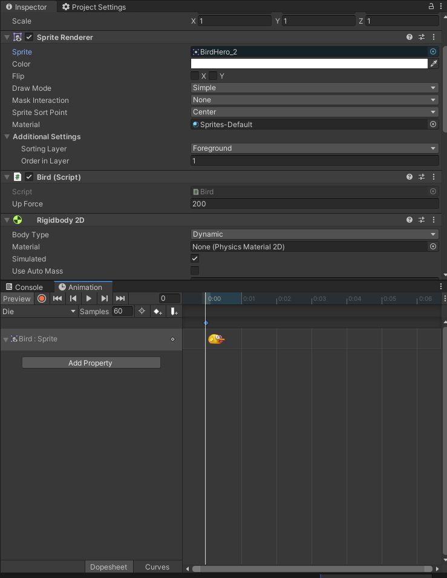
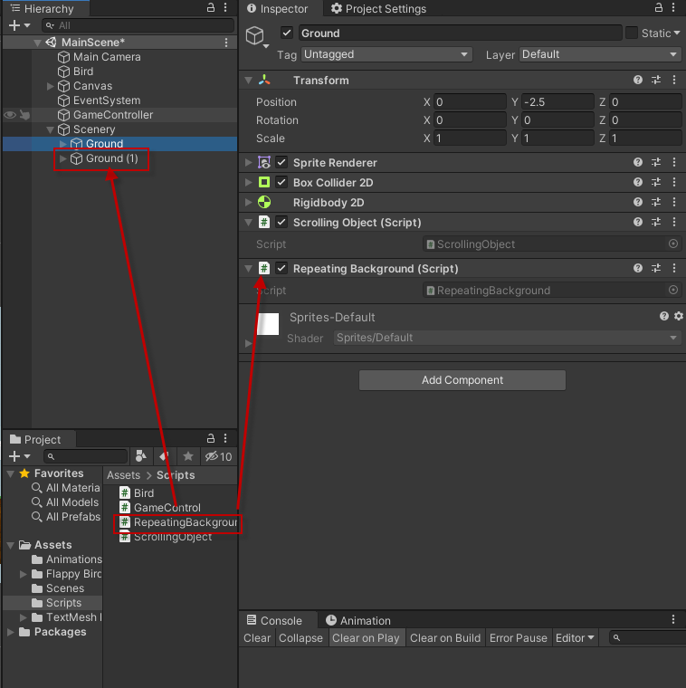

# tutorial-flappy-bird

Unity官方範例 https://learn.unity.com/tutorial/live-session-making-a-flappy-bird-style-game

# 








# Bird.cs
```csharp
using System.Collections;
using System.Collections.Generic;
using UnityEngine;

public class Bird : MonoBehaviour
{
    public float upForce = 200;
    private bool isDead = false;
    private Rigidbody2D rb2d;
    private Animator anim;

    // Start is called before the first frame update
    void Start()
    {
        rb2d = GetComponent<Rigidbody2D>();
        anim = GetComponent<Animator>();
    }

    // Update is called once per frame
    void Update()
    {
        if(isDead == false)
        {
            if (Input.GetMouseButtonDown(0))
            {
                rb2d.velocity = Vector2.zero;
                rb2d.AddForce(new Vector2(0, upForce));
                anim.SetTrigger("Flap");
            }
        }
    }

    private void OnCollisionEnter2D(Collision2D collision)
    {
        isDead = true;
        anim.SetTrigger("Die");
        rb2d.velocity = Vector2.zero;
        GameControl.instance.BirdDied();
    }
}

```

# GameControl.cs
```csharp
using System.Collections;
using System.Collections.Generic;
using UnityEngine;
using UnityEngine.SceneManagement;
using TMPro;
public class GameControl : MonoBehaviour
{
    public static GameControl instance;
    public GameObject gameOverText;
    public bool gameOver;
    public float scrollSpeed = -1.5f;
    public TextMeshProUGUI scoreText;
    private int score;

    private void Awake()
    {
        gameOverText.SetActive(false);
        if (instance == null)
            instance = this;
        else
            Destroy(gameObject);
    }

    // Update is called once per frame
    void Update()
    {
        if (gameOver && Input.GetMouseButtonDown(0))
        {
            SceneManager.LoadScene(0);
        }
    }

    public void BirdDied()
    {
        gameOverText.SetActive(true);
        gameOver = true;
    }

    public void BirdScored()
    {
        if (gameOver)
        {
            return;
        }
        score++;
        scoreText.text = "SCORE: " + score;
    }
}

```
# ScrollingObject.cs
```csharp
using System.Collections;
using System.Collections.Generic;
using UnityEngine;

public class ScrollingObject : MonoBehaviour
{
    private Rigidbody2D rb2d;
    // Start is called before the first frame update
    void Start()
    {
        rb2d = GetComponent<Rigidbody2D>();
        rb2d.velocity = new Vector2(GameControl.instance.scrollSpeed, 0);
    }

    // Update is called once per frame
    void Update()
    {
        if(GameControl.instance.gameOver)
        {
            rb2d.velocity = Vector2.zero;
        }
    }
}

```
# RepeatingBackground.cs
```csharp
using System.Collections;
using System.Collections.Generic;
using UnityEngine;

public class RepeatingBackground : MonoBehaviour
{
    private BoxCollider2D groundCollider;
    private float groundHorizontalLength;

    // Start is called before the first frame update
    void Start()
    {
        groundCollider = GetComponent<BoxCollider2D>();
        groundHorizontalLength = groundCollider.size.x;
    }

    // Update is called once per frame
    void Update()
    {
        if (transform.position.x < -groundHorizontalLength)
        {
            RepositionBackground();
        }
    }

    private void RepositionBackground()
    {
        Vector2 groundOffset = new Vector2(groundHorizontalLength * 2f, 0);
        transform.position = (Vector2)transform.position + groundOffset;
    }
}

```
# Column.cs
```csharp
using System.Collections;
using System.Collections.Generic;
using UnityEngine;

public class Column : MonoBehaviour
{
    private void OnTriggerEnter2D(Collider2D other)
    {
        if (other.GetComponent<Bird>() != null)
        {
            GameControl.instance.BirdScored();
        }
    }
}
```
# ColumnPool.cs
```csharp
using System.Collections;
using System.Collections.Generic;
using UnityEngine;

public class ColumnPool : MonoBehaviour
{
    public int columnPoolSize = 5;
    public GameObject columnPrefab;
    public float spawnRate = 4f;
    public float columnMin = -1f;
    public float columnMax = 3.5f;

    private GameObject[] columns;
    private Vector2 objectPoolPosition = new Vector2(-15f, -25f);
    private float timeSinceLastSpawned;
    private float spawnXPosition = 10f;
    private int currentColumn = 0;

    // Start is called before the first frame update
    void Start()
    {
        columns = new GameObject[columnPoolSize];
        for (int i = 0; i < columnPoolSize; i++)
        {
            columns[i] = Instantiate(columnPrefab, objectPoolPosition, Quaternion.identity);
        }
    }

    // Update is called once per frame
    void Update()
    {
        timeSinceLastSpawned += Time.deltaTime;
        if (GameControl.instance.gameOver == false && timeSinceLastSpawned >= spawnRate)
        {
            timeSinceLastSpawned = 0;
            float spawnYPosition = Random.Range(columnMin, columnMax);
            columns[currentColumn].transform.position = new Vector2(spawnXPosition, spawnYPosition);
            currentColumn++;
            if(currentColumn >= columnPoolSize)
            {
                currentColumn = 0;
            }
        }
    }
}

```
